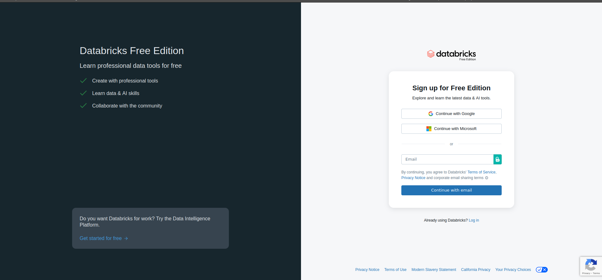

# Connection to Databricks Free Edition

During the labs, we will be using the free Databricks platform, called Free Edition.
Before using it, you need to create an account.

**NOTE:** Databricks offer two trial versions of their platform:

- Community Edition: unlimited time, limited functionality. Hosted on AWS (you don't need to select it yourself).
- Free Trial: 14 days of all functionalities. You can choose the cloud provider. Databricks' service is free, but other resources (VM, storage...) is charged by the cloud provider.

**Pay attention to sign up for Free Edition.** It should never ask you for your credit card details nor to choose a cloud provider.

## 1. Create an account

Go to the following link: https://www.databricks.com/learn/free-edition.

Click `Sign up`

Enter email and click `Continue with email`. You will be redirected to a page to enter a security code that has been sent to the email you provided.

You should be directed to an account setup prompt. Ensure your region is correct in the `Where are you located` drop down and click continue.

This will bring you to a site with a puzzle. Sometimes it takes a lot of patience ;)

At the end, you should end up in your Databricks **workspace**.

## 2. Connect to the existing account

Go to the following link https://login.databricks.com/?dbx_source=www&itm=main-cta-login&l=en-EN&tuuid=2bd5abe5-5962-48b7-a05d-21bd2d5d8292 and **sign in**.

You should end up in your Databricks **workspace**.

