# Lab: Utilize Databricks Git Folders

Databricks provides an API and visual client that allows users to integrate Git repos within a Databricks workspace. Users can utilize many common Git operations including push, pull, branch management, diff, etc. This allows for better source control and colaboration on projects directly in the Databricks workspace. The lab will guide users through configuring a new Git project on Databricks.  

## Objectives

- Create a new Databricks Git integration project

## Tasks

1. Create a new Git project (easy level)
2. Git provider configuration (easy level)
3. Databricks Git Folders configuration (easy level)
4. Databricks Git UI utilization (easy level)

## Prerequisites

- An existing Databricks workspace
- An existing account on a Git provider such as Github or Gitlab
- Familiarity with Git and basic Git commands

## Part 1. Create a new Git project

A new Git repository on [Github](https://docs.github.com/en/repositories/creating-and-managing-repositories/creating-a-new-repository) or [Gitlab](https://docs.gitlab.com/user/project/repository/) is created if a project for Databricks does not already exist.

## Part 2. Git provider configuration

Git providers such as Github and Gitlab provide an alternative to using passwords or ssh that can be useful when interacting with APIs or the command line. 

There are two types of Personal Access Tokens (PATs) available in Github: [Personal access tokens (classic)](https://docs.github.com/en/authentication/keeping-your-account-and-data-secure/managing-your-personal-access-tokens#personal-access-tokens-classic) and [Fine-grained personal access tokens](https://docs.github.com/en/authentication/keeping-your-account-and-data-secure/managing-your-personal-access-tokens#fine-grained-personal-access-tokens). but free accounts may need to use classic tokens when accessing projects owned by other users. Gitlab users on the free tier are limited to [Personal access tokens](https://docs.gitlab.com/user/profile/personal_access_tokens/). More fine-grained options are available to users of the Premium, Ultimate, and Self-Managed versions of Gitlab. The appropriate token type will depend on the user's account type and repository access needs.

### Github Option 1: Configure Personal Access token (classic)

After signing into Github, click on the user icon in the upper right hand corner and select settings from the drop down.

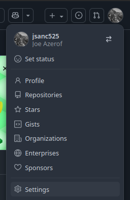  

On the settings page scroll down and select the `< > Developer settings` option.  

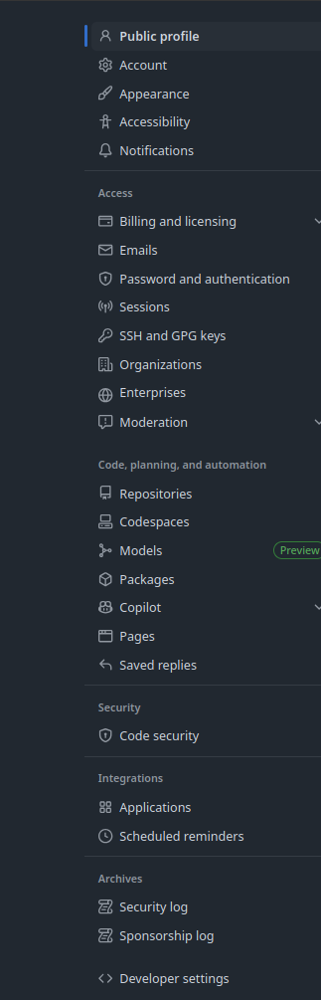  

Expand the `Personal access tokens` menu and select `Tokens (classic)`. On the right hand side click `Generate new token` and select `Generate new token (classic)`.

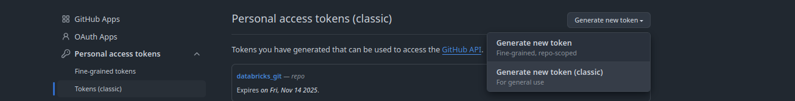 

Add a note for the token usage such as `databricks labs`. This will make it easier to manage tokens as needed. The default expiration date is 30 days. It can be changed as needed. Under `select scopes`, the `repo` option is selected to allow full access to private repositories.  

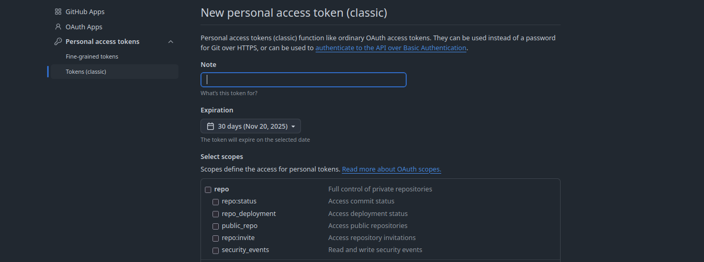

Scroll to the bottom of the page and click on `Generate token`. A new access token is generated. The token should be copied to a secure location such as a password manager as the token cannot be seen again after navigating away from the page. [Proceed to the configuring databricks section](#Part-2:-Databricks-Git-Folders-configuration)

### Github Option 2: Configure Fine-grained Personal Access Token

Fine-grained tokens limit access to specific repositories. Ensure an appropriate project exists prior to begining this option.  

After signing into Github, click on the user icon in the upper right hand corner and select settings from the drop down.

 

On the settings page scroll down and select the `< > Developer settings` option.  

  

Expand the `Personal access tokens` menu and select `Fine-grained tokens`. On the right hand side click `Generate new token`.  

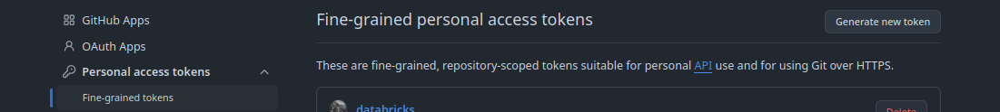

Configure the token name. Token names must be unique and should be named such that they are easy to manage and track, such as the repository they have access to or the application that is using the token in the case that multiple repositories are being accessed. The default expiration date of 30 days may be changed as desired. Configure the repository access. In general, it is recommended to follow the principles of least privilege and scope the token to access only select repositories.

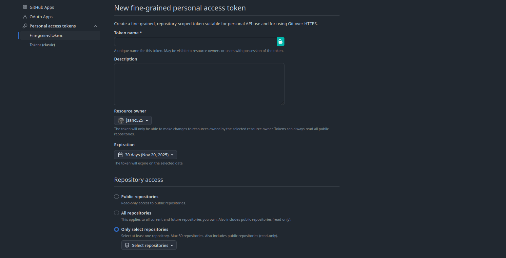

Configure the repository permissions. Click `Add permissions` and search for `contents`. Github automatically adds the required `Metadata` permission.

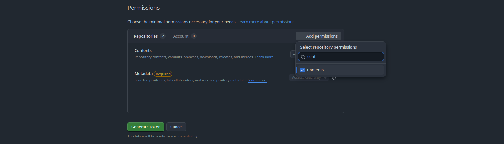

Select `Read and write` from the drop down menue (Databricks integration will require both), and click 'Generate token`.

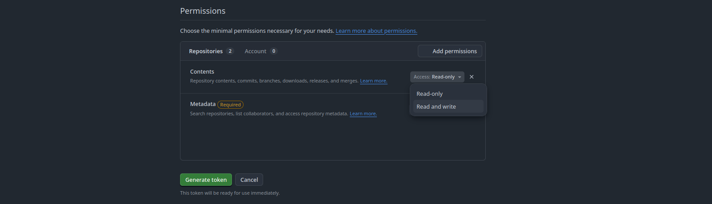

A new access token is generated. The token should be copied to a secure location such as a password manager as the token cannot be seen again after navigating away from the page. [Proceed to the configuring databricks section](#Part-2:-Databricks-Git-Folders-configuration)

### Gitlab Option: Configure a Personal Access Token

A Gitlab [personal access token](https://docs.gitlab.com/user/profile/personal_access_tokens/) will be configured for Databricks projects. According to the Databricks [documentation](https://docs.databricks.com/aws/en/repos/get-access-tokens-from-git-provider#gitlab) it is also possible to use [project tokens](https://docs.gitlab.com/user/project/settings/project_access_tokens/) but there have been [issues reported](https://community.databricks.com/t5/data-engineering/gitlab-integration/m-p/92989/highlight/true#M38602) utilizing project access tokens. Users may attempt to do project access tokens if their Gitlab allows for it but may end up falling back to personal access tokens.  

After signing into Gitlab click on the user icon near the top left and select `Preferences`.  

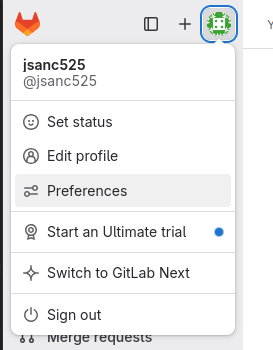

Select the `Personal access tokens` from the menu on the left and click add new token.  

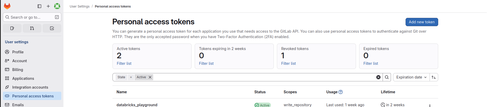

Configure the token name. Token names are not required to be unique, but, giving tokens unique names will make tokens easier to manage and track. The default expiration date of 30 days may be changed as desired.  

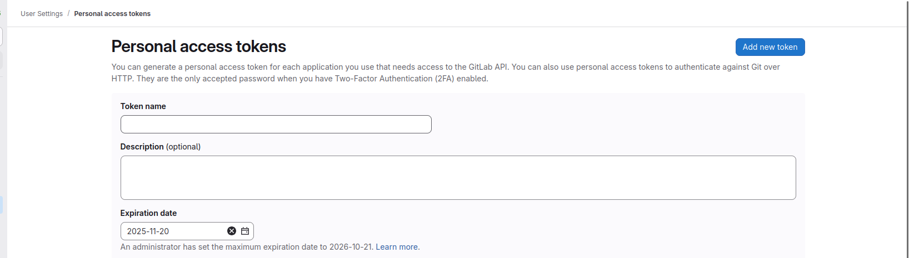

Databricks will require read and write access to the repository. In `Select scopes` select the `write_repository` to enable read and write permissions, and then click `Create token`.  

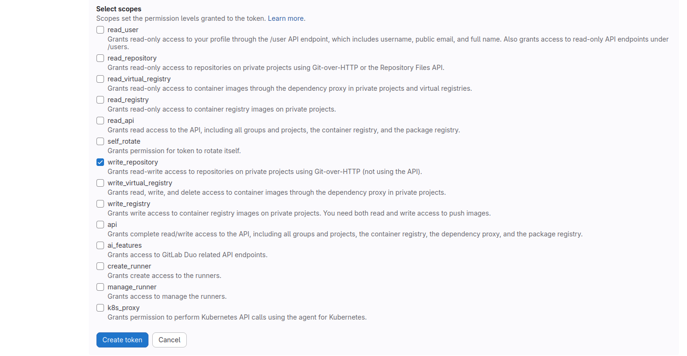

A token will be generated. **Note:** Make sure the token is saved somewhere like a password manager as it cannnot be accessed after navigating away from the page. [Proceed to the configuring databricks section](#Part-2:-Databricks-Git-Folders-configuration)

## Part 3: Databricks Git Folders configuration

Databricks access to the Git provider is first configured by linking accounts. After logging in to the Databricks account, click on the user icon in top right hand corner and select `settings` from the drop down menu. 

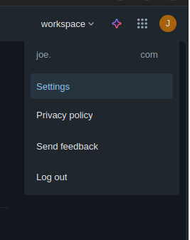

In the settings menu, select the `Linked Accounts` option.  

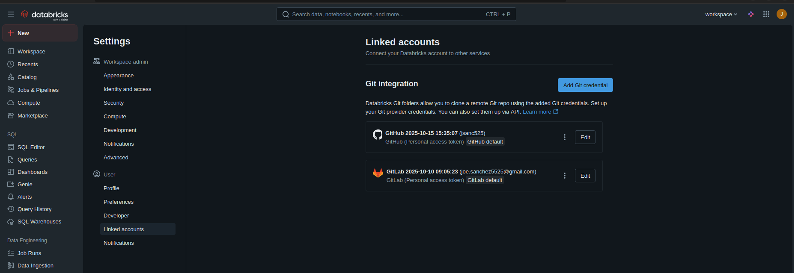

Select `Add Git credential`. Select the chosen provider and the `Personal access token` option. Fill in the provider email or username, paste the token and click save.

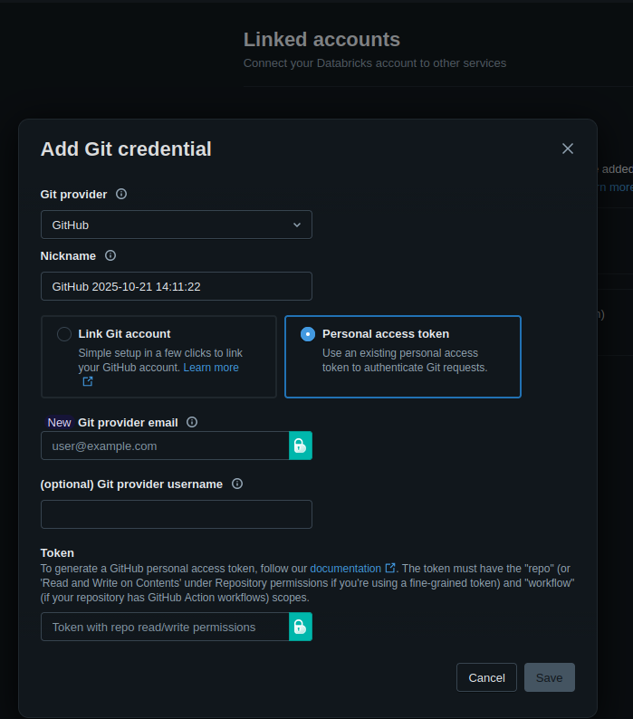

After the Git provider account has been linked, navigate to `Workspace > Users`. Inside the users directory, click `Create` and select `Git folder` from the drop down.  

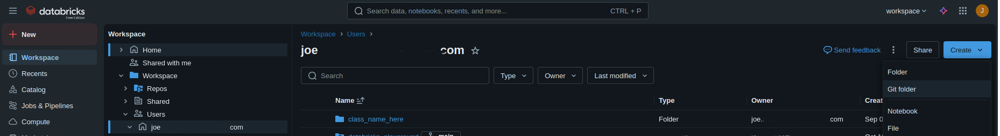

In the `Create Git folder`, past the url for the desired repo and indicate the correct Git provider. Provide a Git folder name. It is not required that the name of the folder in Databricks match the Git repository name, but this is the best choice for the majority of the cases.  

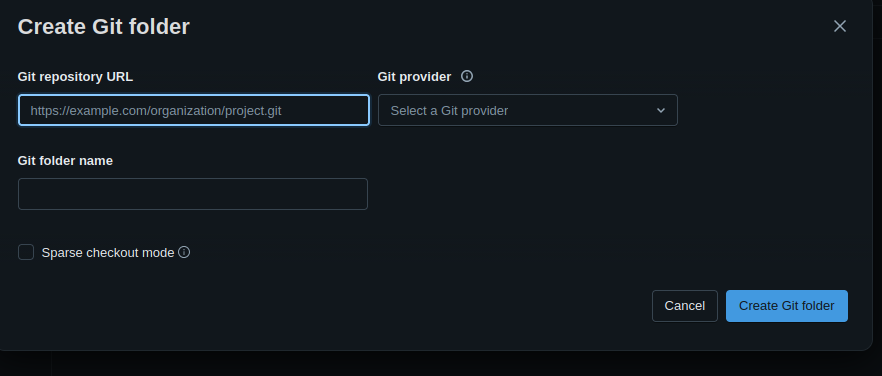

## Part 4: Databricks Git UI utilization

Databricks provides a convienient UI for utilizing common Git commands.

Navigate to the Git project configured in the previous step and create a new markdown file by clicking the `Create` button on the upper right hand corner and selecting the `File` option. Change the file name to something to mark it as a temporary such as `temp_file.md`.

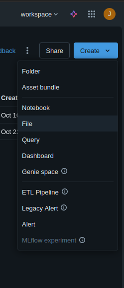  

Once the file has been added and renamed, add and save some simple content to the file through the Databricks UI. After saving the modified file launch the Databricks Git UI by clicking on the branch name near the top left side of the file.    

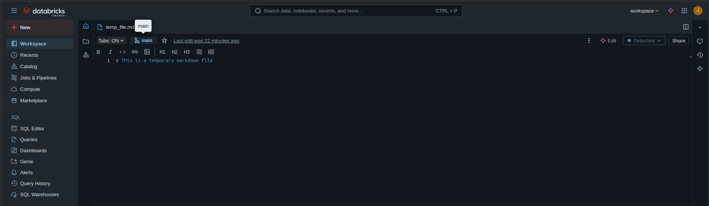  

The UI is launched and the file just created is listed as a changed file. After an appropriate commit message has been added, the changes in the Databricks Git are added to the Git remote dir by clicking the `Commit & Push` button in the bottom left corner.  

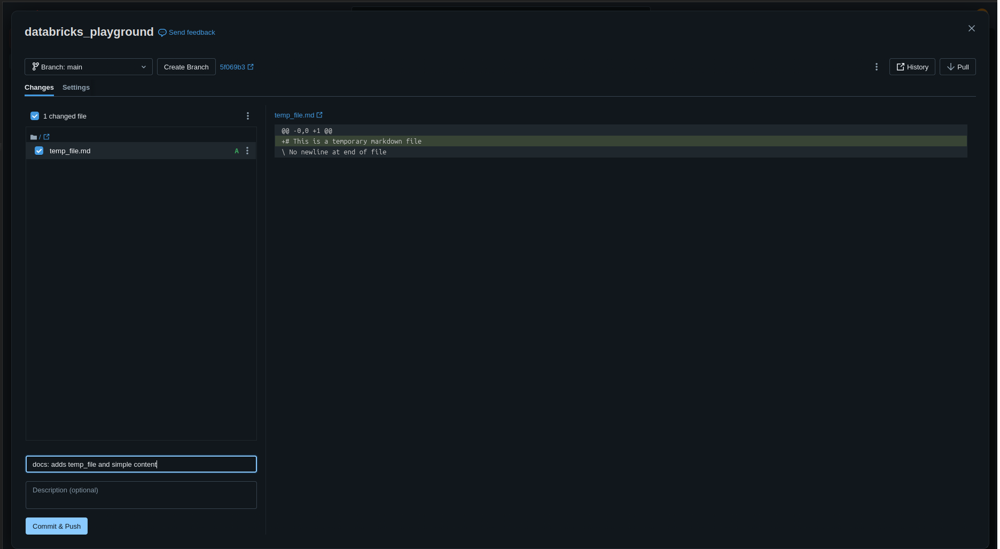  

Work with the changes locally by cloning the project to the local machine or doing a `git pull` in the case that the repo has already been cloned.  Remove the temp file locally, commit and push the change to the remote Git provider. 

```bash
# Copy project from remote Git provider in the case it does not exist locally
git clone '<remote_repo_url>'

# Or pull the changes if the repo already exists locally
git pull

# Remove the temp file locally
git rm '<temp_file>'

# Commit and push the changes
git commit -m "fix: removes temp file"
git push
```

Finally, ensure the changes are updated in Databricks. Return to the Databricks project and launch the Git UI. Click the `Pull` button in the top right corner to sync changes from the remote Git provider. **Note:** The number next to `Pull` on the button indicates the number of commits that will be pulled from the remote repository. Additionally a warning message may appear letting users know that certain content like `cell outputs, visualizations, dashboards...` will be cleared by completing the pull.  

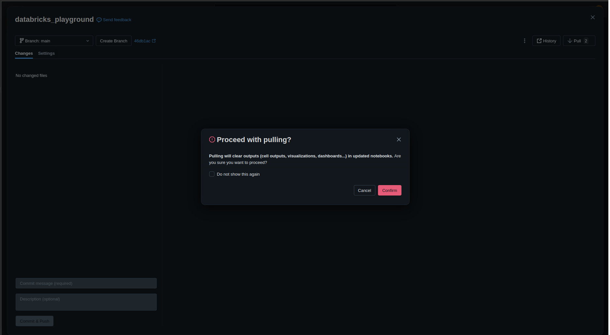
