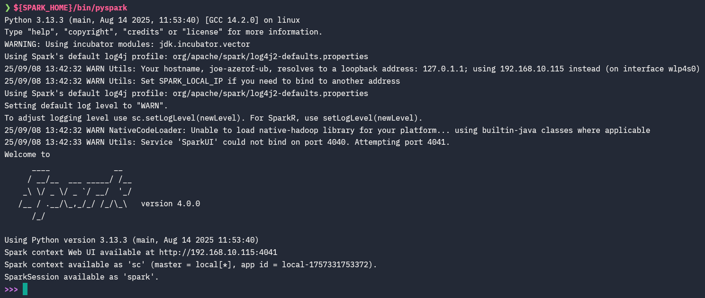

# Data Engineering with Spark

The following lab utilizes Spark RDDs to perform basic text cleaning of unstructured text data.

## Lab Prerequisites

This lab will utilize local java, spark, and python installations.

### Download and Install java

Download a compatible java version.

```bash
# Download java
 wget -nc -q https://download.java.net/java/GA/jdk21.0.2/f2283984656d49d69e91c558476027ac/13/GPL/openjdk-21.0.2_linux-x64_bin.tar.gz

# Decompress tar.gz
 tar -xvzf openjdk-21.0.2_linux-x64_bin.tar.gz

# Optional: create directory for multiple java environment management and mv the extracted directory
sudo mkdir /opt/jdk
sudo mv jdk-21.0.2 /opt/jdk/
```

### Download and Install Spark

Download and install Apache Spark.

```bash
# Download Spark
wget -nc -q https://downloads.apache.org/spark/spark-4.0.0/spark-4.0.0-bin-hadoop3.tgz

# Unpack the binaries
tar -xf spark-4.0.0-bin-hadoop3.tgz

# Optional: move Spark to directory of choice
sudo mv spark-4.0.0-bin-hadoop3 /opt/spark
```

### Verify Setup

Verify the correct installation of java and Spark by opening the pyspark terminal.

```bash
# Set the session level environment variables
export JAVA_HOME=/opt/jdk/jdk-21.0.2 # replace with appropriate path
export SPARK_HOME=/opt/spark # replace with appropriate path

# Start the pyspark terminal
${SPARK_HOME}/bin/pyspark
```

The pyspark command will open a pyspark terminal.



Once the terminal is open, run a simple pyspark command to verify the setup.

```python
spark.sql("SELECT 1 as test").show()
```

# Start a Jupyter Notebook Server

Create a python virtual environment with preferred python environment manager and run the notebook command from a directory containing the lab.

```bash
# Create a python env
<command(s) to create python env here>

# Install require libraries
<install command> jupyter notebook
<install command> findspark
<install command> pyspark

# Start env
<command to start env here>

# Change to dir containing lab
cd <dir_containing_lab>

# Start the jupyter notebook Server
jupyter notebook
```

## Lab 1: Unstructured data analysis with RDDs

Analyze unstructured data (text) with RDDs and Spark Core Functions.

### Goals

- Get familiar with the Databricks environment
- Get familiar with the most frequently used functions for RDD processing: `map`, `flatMap`, `reduceByKey`
- Learn how to define lambda functions
- Learn when you can use pure Python functionalities and constructs in Spark environment

### Lab resources

- [Notebook](./lab_pyspark_local_stand_alone/word_count.ipynb)
- The text file is obtained from [Project Gutenberg](https://www.gutenberg.org/ebooks/103.txt.utf-8) using the cell magic `!wget` in the ipynotebook.

### Useful links

- [RDD programming guide](https://spark.apache.org/docs/latest/rdd-programming-guide.html)
    - especially chapters `Transformations` and `Actions`

### TO DO

Go through the notebook and follow the instructions in the cells:

1. Open the book obtained from project guttenberg and:

- count the occurrence of each word
- change all capital letters to lower case
- remove stopwords
- sort the words and their counts in alphabetical order
- sort from most to least frequent word
- remove punctuations
- answer questions about code where applicable

2. Look at the given code and try to understand what it does.

- provide line by line code comments
